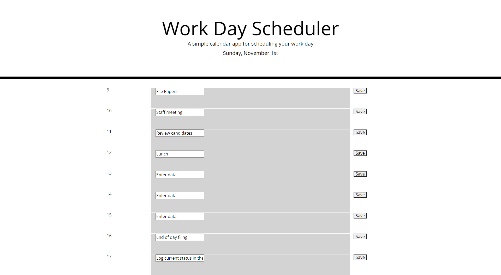

# Work-Day-Scheduler

-- Motivation: The goal of this project was to create a 7 day event planner that would log inputs for each hour of the work day beginning at 9am and ending at 5pm.  Each row element will be automatically
updated using Jquery and moment.js to help the user identify what is past, present and future.  Future items are marked in green, the present item is makred red, and previous items are marked grey.  Users
would then be able to save their inputs to local storage using a button for each hour, so when the page is reloaded they will have their previous inputs appear in the respective hour.  Users will be greeted with 
day of the week and month when laoding the page.    

-- Usage: Users have the ability to enter in a task for each hour of their 9 to 5 work day. users can enter any form of text and save their hourly task to local storage.  Once saved, users
can exit the webpage and reload it at a later date/time and refer to the saved task.  users can easily identify which tasks are approaching and which have been completed by the color coordination of
rows depending on the current time.  

Green - future
Red - Present
Grey - Past

-- Image of webpage :

